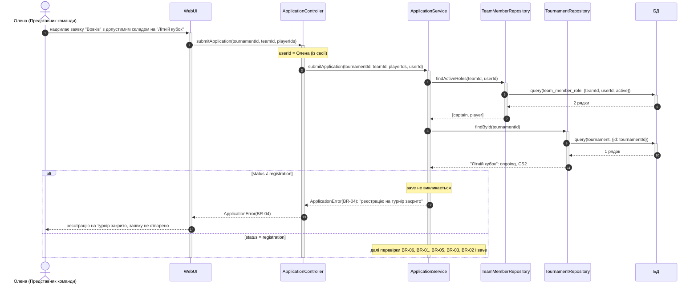

# S-07 - Турнір уже розпочато

- Gherkin: `@S-07`, помилковий шлях; BR-04.
- Фрагменти: `alt` на BR-04.
- BR-07 пройдено; турнір "Літній кубок" має статус ongoing, далі перевірки не виконуються.

```mermaid
sequenceDiagram
    autonumber
    actor Rep as Олена (Представник команди)
    participant UI as WebUI
    participant Ctrl as ApplicationController
    participant Svc as ApplicationService
    participant TMR as TeamMemberRepository
    participant TR as TournamentRepository
    participant DB as БД

    Rep->>+UI: надсилає заявку "Вовків" з допустимим складом на "Літній кубок"
    UI->>+Ctrl: submitApplication(tournamentId, teamId, playerIds)
    Note over Ctrl: userId = Олена (із сесії)
    Ctrl->>+Svc: submitApplication(tournamentId, teamId, playerIds, userId)

    Svc->>+TMR: findActiveRoles(teamId, userId)
    TMR->>+DB: query(team_member_role, {teamId, userId, active})
    DB-->>-TMR: 2 рядки
    TMR-->>-Svc: [captain, player]

    Svc->>+TR: findById(tournamentId)
    TR->>+DB: query(tournament, {id: tournamentId})
    DB-->>-TR: 1 рядок
    TR-->>-Svc: "Літній кубок": ongoing, CS2

    alt status ≠ registration
        Note over Svc: save не викликається
        Svc-->>Ctrl: ApplicationError(BR-04): "реєстрацію на турнір закрито"
        Ctrl-->>UI: ApplicationError(BR-04)
        UI-->>Rep: реєстрацію на турнір закрито, заявку не створено
    else status = registration
        Note over Svc: далі перевірки BR-06, BR-01, BR-05, BR-03, BR-02 і save
    end
    deactivate Svc
    deactivate Ctrl
    deactivate UI
```
